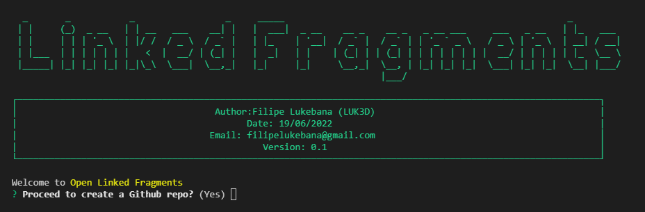

# Open Linked Fragments

Welcome to OLF Project.

The goal of this project it's to make possible for people to store any file of any size to the github in secured form. We achieved this by providing an encryption channel that processes the files and them sends them to the github repo.